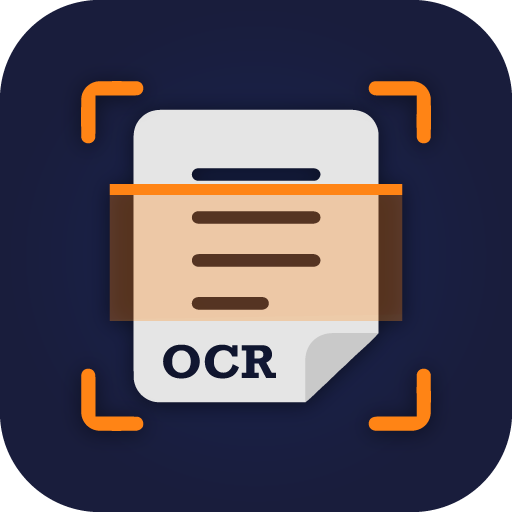

<!-- PROJECT SHIELDS -->


<br>
<br>
[![Contributors][contributors-shield]][contributors-url]
[![Forks][forks-shield]][forks-url]
[![Stargazers][stars-shield]][stars-url]
[![Issues][issues-shield]][issues-url]
[![MIT License][license-shield]][license-url]
[![LinkedIn][linkedin-shield]][linkedin-url]


# AI Hackathon PDF OCR and Data Extraction 📑🔍
<!-- PROJECT LOGO -->
<br />
<div align="center">
  <a>
    
  </a>
</div>


## 🌟 Project Overview

This project, developed as part of an AI Hackathon, focuses on Optical Character Recognition (OCR) and data extraction from PDF documents. It's a collaborative effort by @pabloortega, @hugo, and other contributors.

### Key Features:
- 📄 OCR processing of PDFs.
- 📊 Data extraction and analysis.
- 📈 CSV format creation from extracted data.

## 📚 Table of Contents
- [Installation](#installation)
- [Usage](#usage)
- [Project Structure](#project-structure)
- [Contributing](#contributing)
- [License](#license)

## 🛠 Installation

To set up the project, follow these steps:

1. Clone the repository:
   ```bash
   git clone https://github.com/vtwoptwo/ai-hackathon.git
   
## 🛠 Installation

2. Navigate to the project directory:

```bash
cd ai-hackathon
```

### Setup

Build the project (all commands from the root of the repository):
```bash
python3 -m build
```
Don't forget to create a `.env` file with the following variables outlines in the `env/example` file.


Create a virtual environment and install the dependencies:
```bash
pip install -e .
```


## 🚀 Usage


### Running the Code
There are optional arguments for the main.py file:

```bash
python3 src/analysis/main.py 
```

You can also use the Makefile to run the code:

```bash

    make build
    make run
```

## 📁 Project Structure

``` css

src/analysis
├── Makefile
├── column_processors
│   ├── __init__.py
│   ├── barrier.py
│   ├── cap.py
│   ├── ...
│   └── underlyings.py
├── create_the_csv_format_from_ground_truth.ipynb
├── main.py
├── ocr.py
└── predictions.csv
```

## 👥 Contributing

Contributions are welcome! For major changes, please open an issue first to discuss what you would like to change.

## 📄 License
MIT License - see the LICENSE file for details. Due to the NDA we assigned, we are not able to share the pdf files.


***
<!-- MARKDOWN LINKS & IMAGES -->
<!-- https://www.markdownguide.org/basic-syntax/#reference-style-links -->
[contributors-shield]: https://img.shields.io/github/contributors/vtwoptwo/ai-hackathon.svg?style=for-the-badge
[contributors-url]: https://github.com/vtwoptwo/ai-hackathon/graphs/contributors
[forks-shield]: https://img.shields.io/github/forks/vtwoptwo/ai-hackathon.svg?style=for-the-badge
[forks-url]: https://github.com/vtwoptwo/ai-hackathon/network/members
[stars-shield]: https://img.shields.io/github/stars/vtwoptwo/ai-hackathon.svg?style=for-the-badge
[stars-url]: https://github.com/vtwoptwo/ai-hackathon/stargazers
[issues-shield]: https://img.shields.io/github/issues/vtwoptwo/ai-hackathon.svg?style=for-the-badge
[issues-url]: https://github.com/vtwoptwo/ai-hackathon/issues
[license-shield]: https://img.shields.io/github/license/vtwoptwo/ai-hackathon.svg?style=for-the-badge
[license-url]: https://github.com/vtwoptwo/ai-hackathon/blob/master/LICENSE.txt
[linkedin-shield]: https://img.shields.io/badge/-LinkedIn-black.svg?style=for-the-badge&logo=linkedin&colorB=555
[linkedin-url]: https://www.linkedin.com/in/vera-prohaska-31734b1b5/
[Next.js]: https://img.shields.io/badge/next.js-000000?style=for-the-badge&logo=nextdotjs&logoColor=white
[Next-url]: https://nextjs.org/
[React.js]: https://img.shields.io/badge/React-20232A?style=for-the-badge&logo=react&logoColor=61DAFB
[React-url]: https://reactjs.org/
[Vue.js]: https://img.shields.io/badge/Vue.js-35495E?style=for-the-badge&logo=vuedotjs&logoColor=4FC08D
[Vue-url]: https://vuejs.org/
[Angular.io]: https://img.shields.io/badge/Angular-DD0031?style=for-the-badge&logo=angular&logoColor=white
[Angular-url]: https://angular.io/
[Svelte.dev]: https://img.shields.io/badge/Svelte-4A4A55?style=for-the-badge&logo=svelte&logoColor=FF3E00
[Svelte-url]: https://svelte.dev/
[Laravel.com]: https://img.shields.io/badge/Laravel-FF2D20?style=for-the-badge&logo=laravel&logoColor=white
[Laravel-url]: https://laravel.com
[Bootstrap.com]: https://img.shields.io/badge/Bootstrap-563D7C?style=for-the-badge&logo=bootstrap&logoColor=white
[Bootstrap-url]: https://getbootstrap.com
[JQuery.com]: https://img.shields.io/badge/jQuery-0769AD?style=for-the-badge&logo=jquery&logoColor=white
[JQuery-url]: https://jquery.com 
[CPP-url]: https://cplusplus.com/
[C++]: https://img.shields.io/badge/C++-blue
[Postgres]: https://img.shields.io/badge/postgres-%23316192.svg?style=for-the-badge&logo=postgresql&logoColor=white
[Postgres-url]: https://www.postgresql.org/
[Flask]: https://img.shields.io/badge/flask-%23000.svg?style=for-the-badge&logo=flask&logoColor=white
[Flask-url]: https://flask.palletsprojects.com/en/2.2.x/
[Postman]: https://img.shields.io/badge/Postman-FF6C37?style=for-the-badge&logo=postman&logoColor=white
[Postman-url]: https://www.postman.com/
[Docker]: https://img.shields.io/badge/docker-%230db7ed.svg?style=for-the-badge&logo=docker&logoColor=white
[Docker-url]: https://www.docker.com/
[MongoDB]: https://img.shields.io/badge/MongoDB-%234ea94b.svg?style=for-the-badge&logo=mongodb&logoColor=white
[MongoDB-url]: https://www.mongodb.com/home
